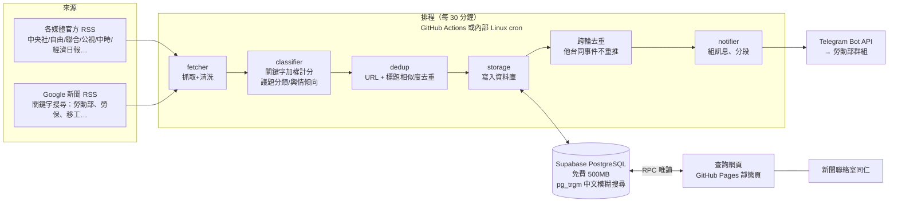

# 勞動部新聞收錄與 Telegram 推播系統

取代委外的每日新聞整理服務：自動抓取各大媒體官方 RSS 與 Google 新聞，以關鍵字加權判斷是否與勞動部相關，**每 30 分鐘**把新進新聞（標題、摘要、連結）推播到勞動部 Telegram 群組，並將所有歷史新聞存入雲端免費資料庫，提供新聞聯絡室以**關鍵字、議題、輿情傾向、來源、期間**查詢歷史新聞。

全部元件使用免費方案，每月成本 0 元。

---

## 1. 系統架構



| 元件 | 技術 | 免費額度 / 說明 |
|---|---|---|
| 排程執行 | GitHub Actions（或機關內部主機 cron） | 公開 repo 分鐘數不限；私有 repo 每月 2,000 分鐘（每次約 1 分鐘 × 48 次/天 ≈ 1,440 分鐘/月，接近上限，建議公開 repo 或內部主機） |
| 外部觸發（建議） | cron-job.org 呼叫 `workflow_dispatch` | GitHub 內建 cron 尖峰會延遲 5–15 分鐘，外部觸發較準時 |
| 資料庫 | Supabase（PostgreSQL） | 500MB；純文字新聞每年約數十 MB。**連續 7 天無活動會暫停專案**，本系統每 30 分鐘寫入，不會觸發 |
| 查詢網頁 | 單一 HTML + supabase-js，部署於 GitHub Pages | 免費；亦可放 Cloudflare Pages 或部內網站 |
| 推播 | Telegram Bot API | 免費；群組每分鐘 20 則上限，程式已控速 |

### 資料流程（每一輪）

1. **抓取**：平行抓取 `config/sources.yaml` 所列 RSS 與 Google 新聞查詢；只保留 36 小時內發布者；單一來源失敗只記錄警告，不影響其他來源。
2. **關聯判斷**：`config/keywords.yaml` 加權計分（見第 3 節），達門檻才收錄。
3. **同批去重**：相同 URL，或標題相似（字元序列相似度 ≥ 0.72，或二字詞重疊度 ≥ 0.6，可處理詞序對調）視為同一則；優先保留「媒體原站連結 > 有摘要 > 分數高」者。
4. **補摘要**：RSS 摘要少於 30 字者，到原文抓 `og:description`。
5. **入庫**：以 URL 雜湊為唯一鍵，已存在者略過。
6. **跨輪去重**：尚未推播的新聞若與 48 小時內已推播者相似，標記 `dup_of`（入庫可查，但不重複推播）。
7. **推播**：分數高者在前，單次最多 30 則（其餘留下一輪）；超過 4,096 字自動分段；**只有成功送出的新聞才標記已推播**，失敗者下輪重送。
8. **保護機制**：距上次推播未滿 25 分鐘不推（避免排程重複觸發）；可設定夜間靜音時段，累積到早上一起推。

---

## 2. 專案結構

```
mol-news-bot/
├── config/
│   ├── sources.yaml        # 新聞來源（RSS、Google 新聞查詢詞）
│   └── keywords.yaml       # 關聯判斷、議題分類、輿情詞典（非工程人員也可維護）
├── news_bot/
│   ├── main.py             # 主流程（python -m news_bot.main）
│   ├── fetcher.py          # RSS / Google 新聞抓取、HTML 清洗、補摘要
│   ├── classifier.py       # 關鍵字加權計分、排除詞、議題、傾向
│   ├── dedup.py            # 標題正規化、相似度去重
│   ├── storage.py          # SupabaseStore（正式）/ SQLiteStore（測試、離線）
│   ├── notifier.py         # Telegram 訊息組版、分段、重試
│   ├── check.py            # 關鍵字調校工具
│   ├── check_sources.py    # 檢查各新聞來源是否可用
│   ├── config.py / models.py
├── sql/schema.sql          # 資料表、索引、查詢函式、權限（RLS）
├── web/index.html          # 查詢網頁（未設定資料庫時自動顯示示範資料）
├── .github/workflows/
│   ├── ci.yml              # 自動測試（push / PR）
│   ├── news.yml            # 每 30 分鐘執行
│   └── pages.yml           # 測試通過後部署查詢網頁到 GitHub Pages
├── CLAUDE.md               # Claude Code 專案指引（含安全規則）
├── Claude_Code部署步驟.md   # 用 Claude Code 部署的操作說明
├── .claude/
│   ├── settings.json       # Claude Code 權限（禁止讀取 .env 等）
│   └── commands/deploy.md  # /deploy 指令：自動部署、測試、發布、驗證
├── deploy/
│   ├── push_secrets.sh/.ps1 # 從 .env 寫入 GitHub Secrets 並驗證 Supabase、Telegram
│   ├── setup_github.sh     # 一鍵部署（bash）
│   ├── setup_github.ps1    # 一鍵部署（Windows PowerShell）
│   └── crontab.example     # 內部主機部署用
├── tests/test_pipeline.py  # 16 項測試（分類、去重、分段、端到端）
├── requirements.txt
└── .env.example
```

---

## 3. 關聯判斷與議題分析邏輯

| 類別 | 權重 | 例 |
|---|---|---|
| 機關與首長（core） | 10 | 勞動部、勞保局、勞發署、職安署、勞動基金運用局、洪申翰 |
| 議題關鍵字 | 3–5 | 勞保年金、基本工資、職災、移工、育嬰留職停薪… |

- 出現在**標題**時權重 ×2；同一關鍵字只計一次。
- 總分 ≥ **8** 才收錄。
- **沒有點名機關時，至少要命中 2 個不同議題詞**，避免「藝人自曝月薪僅三萬」這類誤判。
- **排除詞**：「美國勞動部」「韓國雇用勞動部」等外國機關會扣回「勞動部」的命中；若同篇在其他地方仍提到本部，照常計分。
- **議題**：10 類（勞工保險、勞工退休金、薪資工時、勞資關係、職業安全、就業服務、職業訓練、移工、性別平等與育兒、勞動權益其他），依該議題得分排序，一則可屬多個議題。
- **輿情傾向**：正/負面詞典比對，標示 🔴負面 / 🟢正面 / ⚪中性，方便新聞聯絡室優先處理負面報導（詞典法，僅供參考）。

調校方式：

```bash
python -m news_bot.check "勞保年金改革 立委砲轟" "勞保基金恐在2031年破產"
# 分數：25（門檻 8）→ ✅ 收錄
# 議題：勞工保險
# 命中：勞保、勞保年金、勞保基金
# 傾向：負面
```

建議上線第一週以 `--no-push` 或測試群組試跑，在網頁上檢視誤收/漏收案例後調整 `keywords.yaml`。**首長異動時記得更新 core 關鍵字。**

---

## 4. Telegram 訊息格式

```
📰 勞動部相關新聞快報（2026/09/17 14:30）共 3 則

1. 【薪資工時】勞動部公布明年基本工資調漲方案
🟢 中央社｜09/17 13:05
審議會今日決議，月薪與時薪均調漲，勞動部長洪申翰表示…
🔗 閱讀全文

2. 【勞工保險】勞保基金財務吃緊 立委質疑撥補力道不足
🔴 自由時報｜09/17 12:40
立法院社福委員會今日質詢…
🔗 閱讀全文

🔎 歷史新聞查詢
```

---

## 5. 部署步驟

### 5.1 建立 Telegram Bot

1. 在 Telegram 找 **@BotFather** → `/newbot` → 取得 **Bot Token**。
2. 將 Bot 加入勞動部群組（若為頻道，需設為管理員）。
3. 在群組內發送 `/start@你的Bot名稱`（Bot 預設隱私模式只收得到指令），瀏覽器開啟
   `https://api.telegram.org/bot<TOKEN>/getUpdates`，找到 `"chat":{"id":-100xxxxxxxxxx}` 即為 **Chat ID**。
4. 建議先建一個測試群組驗證格式，再換成正式群組。

### 5.2 建立 Supabase 資料庫

1. 至 supabase.com 註冊（建議用機關公務信箱或單位共用帳號），建立 Project，Region 選 **Northeast Asia (Tokyo)** 或 **Southeast Asia (Singapore)**。
2. 左側 **SQL Editor** → 貼上 `sql/schema.sql` 全文 → Run。
3. **Project Settings → API** 取得：
   - `Project URL` → `SUPABASE_URL`
   - `service_role` key → `SUPABASE_SERVICE_KEY`（**僅放在排程端**）
   - `anon` key → 填入 `web/index.html`（配合 RLS 唯讀，可公開）

### 5.3 一鍵部署到 GitHub（建議）

> **使用 Claude Code**：填好 `.env` 後在專案資料夾啟動 `claude`，輸入 `/deploy`，詳見 `Claude_Code部署步驟.md`。以下為不使用 Claude Code 的腳本方式。

完成 5.1、5.2 後，在專案根目錄執行（需先安裝 GitHub CLI 並 `gh auth login`）：

```bash
bash deploy/setup_github.sh                                         # macOS / Linux / Git Bash
powershell -ExecutionPolicy Bypass -File deploy\setup_github.ps1    # Windows
```

腳本會依序：建立 repo 並推送 → 設定 4 個 Secrets 與 Variables → 開啟 GitHub Pages → 觸發「測試 + 網頁部署」與「首次試跑（dry-run）」→ 等待並回報結果。bash 版填入 Supabase 資料庫連線字串時會一併建立資料表。

CI/CD 流程：

| Workflow | 觸發 | 內容 |
|---|---|---|
| `ci.yml` 測試 | 每次 push / PR | pytest、YAML 格式檢查、關鍵字判斷抽樣 |
| `pages.yml` 部署查詢網頁 | push 到 main（程式、設定、網頁有變更） | **先跑 ci.yml，通過才部署**；部署時自動把 Variables 的 Supabase 設定注入網頁 |
| `news.yml` 新聞推播 | 每 30 分鐘 / 手動 | 手動執行可選 `normal`、`no-push`、`dry-run` |

以下 5.4、5.5 為手動設定方式，已使用一鍵部署者可略過。

### 5.4 GitHub Actions 排程（手動設定）

1. 建立 GitHub repo，推送本專案。
2. **Settings → Secrets and variables → Actions**
   - Secrets：`TELEGRAM_BOT_TOKEN`、`TELEGRAM_CHAT_ID`、`SUPABASE_URL`、`SUPABASE_SERVICE_KEY`
   - Variables：`SUPABASE_URL`、`SUPABASE_ANON_KEY`（網頁用）；選填 `WEB_URL`、`QUIET_HOURS`（例 `23-7`）、`REQUIRE_LOGIN`（`true`）
3. **Actions** 頁 → 「勞動部新聞推播」→ Run workflow，確認群組收到訊息。
4. （建議）到 cron-job.org 建立每 30 分鐘任務：
   - URL：`https://api.github.com/repos/<帳號>/<repo>/actions/workflows/news.yml/dispatches`
   - Method：POST；Body：`{"ref":"main"}`
   - Headers：`Authorization: Bearer <Fine-grained PAT，只給此 repo 的 Actions: write>`、`Accept: application/vnd.github+json`
   - 如此可準時觸發，且不受「公開 repo 60 天無 commit 自動停用排程」影響。

### 5.5 查詢網頁（手動設定）

1. 確認 Variables 已設 `SUPABASE_URL`、`SUPABASE_ANON_KEY`（部署時自動注入，不必改 HTML）。
2. repo **Settings → Pages → Source 選 GitHub Actions**，推送後 `pages.yml` 自動測試並部署。
3. 網址：`https://<帳號>.github.io/<repo>/`

### 5.6 （替代）部署在部內 Linux 主機

```bash
cd /opt && git clone <repo> mol-news-bot && cd mol-news-bot
python3 -m venv .venv && .venv/bin/pip install -r requirements.txt
cp .env.example .env && vi .env          # 填入 Token 等
mkdir -p logs && .venv/bin/python -m news_bot.main --dry-run
crontab -e                                # 參考 deploy/crontab.example
```

若不設定 Supabase，程式會自動改用本機 SQLite（`news.db`），適合先行內網測試；但查詢網頁需搭配 Supabase（或另行撰寫內網 API）。

---

## 6. 本機開發與測試

```bash
pip install -r requirements.txt pytest
python -m pytest -q                       # 16 passed
python -m news_bot.main --dry-run -v      # 實際抓新聞，只印訊息不推播
python -m news_bot.main --no-push         # 只收錄不推播
```

---

## 7. 資安與維運考量

- **金鑰管理**：Bot Token 與 service_role key 僅存於 GitHub Secrets 或主機 `.env`（已列入 `.gitignore`），不可寫入程式碼或網頁。Token 外洩時至 @BotFather `/revoke` 重新產生。
- **權限最小化**：資料庫啟用 RLS，網頁端只有 `select` 權限，無法寫入或刪除；`run_logs` 不對外開放。
- **查詢網頁存取控制**：新聞屬公開資訊，預設公開唯讀（方案 A）。若要限定同仁使用，採 `schema.sql` 方案 B：Supabase Auth 寄送登入連結，並限定 `@mol.gov.tw` 信箱，網頁設定 `REQUIRE_LOGIN = true`（需至 Supabase Auth 設定網址白名單）。
- **資料範圍**：只儲存標題、摘要（RSS 本身提供）、連結與分類結果，不存全文，避免著作權疑慮。
- **雲端服務評估**：Supabase、GitHub 為境外雲端服務，雖僅處理公開新聞資料，仍建議依部內資通安全管理規定，評估是否可使用境外雲端服務並辦理相關程序；若政策不允許，可採 5.6 內部主機 + SQLite / 部內資料庫方案，程式邏輯不需修改（只需實作同介面的 Store）。
- **監控**：`run_logs` 表記錄每輪抓取/收錄/推播數；可在 Supabase 建立簡單查詢，若連續數小時 `fetched = 0` 表示來源或網路異常。GitHub Actions 失敗會寄信通知 repo 擁有者。
- **來源維護**：媒體 RSS 網址偶有異動，執行紀錄出現「抓取失敗」警告時更新 `sources.yaml` 即可。Google 新聞 RSS 為非正式公開介面，若格式調整需同步修正 `fetcher._fetch_google`。

---

## 8. 後續可擴充

| 項目 | 做法 |
|---|---|
| AI 摘要 / 議題判讀 | 在 `main.run()` 入庫前呼叫 LLM API 產生 50 字摘要與議題，取代關鍵字法（需先依部內生成式 AI 使用規範評估） |
| 每日早報 | 另建 workflow 每日 08:00 執行，彙整前 24 小時負面新聞 Top 10 推播 |
| 即時警示 | 分數特別高或負面且提及部長者，立即單則推播並 @ 指定同仁 |
| 本部新聞稿比對 | 加入部內新聞稿 RSS，統計各新聞稿的媒體露出則數 |
| 趨勢圖 | 網頁加入議題每日則數折線圖（`topic_stats` 改為依日期分組） |
